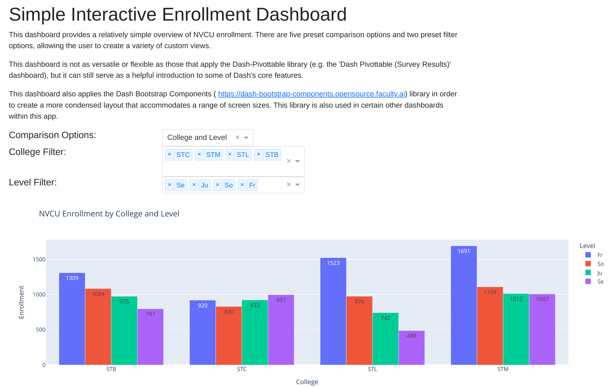

# PFN Dash App Demo

## Readme

**Note:** Visit the corresponding readme within Online_Visualizations/Simple_App_Without_Login for more background information on this section of Python for Nonprofits; Dash apps; and Google Cloud deployment steps. (Items explained within that readme often won't be discussed here.)

In addition, to view the Google Cloud Run-hosted version of this app, visit https://pfndashappdemo-ymc7cs3r5q-uc.a.run.app/ .

The Simple_App_Without_Login project was meant to provide a basic overview of Dash's functionality; this project, on the other hand, is meant to provide a more detailed overview of Dash's capabilities. The interactive online visualizations featured within this app range from simple charts to more complex setups. The app also makes use of both the Flask-Login and Dash-Pivottable libraries.

### Dashboards 

Unlike the Simple_App_Without_Login project, this app features multiple dashboards, each of which occupies its own page.

The **Fixed Dashboard** (https://pfndashappdemo-ymc7cs3r5q-uc.a.run.app/fixed_dashboard) page 
shows a very simple dashboard setup that lacks user-defined filter and comparison settings. 


The **Simple Interactive Dashboard** (https://pfndashappdemo-ymc7cs3r5q-uc.a.run.app/simple_interactive_dashboard) page 
displays a relatively straightforward interactive enrollment dashboard. 
This dashboard didn't require much code to write, but its functionality 
is rather limited.



The **Flexible Survey Results** (https://pfndashappdemo-ymc7cs3r5q-uc.a.run.app/flexible_survey_results_dashboard) and 
**Flexible Enrollment** (https://pfndashappdemo-ymc7cs3r5q-uc.a.run.app/flexible_enrollment_dashboard) dashboard pages
allow for a wide range of comparison and color options. These options are 
made possible by the `autopivot()` and ``autobar()` functions found within 
'auto_pivot_and_graph.py' (https://github.com/kburchfiel/pfn/blob/main/Online_Visualizations/PFN_Dash_App_Demo/auto_pivot_and_graph.py). 
(You may also find these functions useful for developing standlone Plotly charts.)

The Flexible Enrollment Dashboard also makes use of an import_layout() 
function (stored within 'import_layout.py' (https://github.com/kburchfiel/pfn/blob/main/Online_Visualizations/PFN_Dash_App_Demo/import_layout.py)) 
in order to reduce the amount of code needed to define
the page's structure and menu options. In addition, this dashboard
applies the `autotable()` function in 'auto_pivot_and_graph.py' to display
a tabular view of the data featured in the graph.


The dash-pivottable library makes it very easy to 
create interactive dashboards. Examples of this library in use can 
be found within the **Dash Pivottable (Enrollment)** (https://pfndashappdemo-ymc7cs3r5q-uc.a.run.app/dash_pivottable_enrollment) and **Dash Pivottable (Survey Results)** (https://pfndashappdemo-ymc7cs3r5q-uc.a.run.app/dash_pivottable_survey_results) pages.


### Development notes:

1. I made use of a standalone Jupyter notebook (notebook_for_testing.ipynb, available at https://github.com/kburchfiel/pfn/blob/main/Online_Visualizations/PFN_Dash_App_Demo/notebook_for_testing.ipynb) to test out code before integrating it into my Dash app files.

1. The source data is imported from GitHub. A more realistic approach would retrieve data from an online database; however, the GitHub-based approach is simpler and cheaper.

### Project structure

The files and folders in this app are arranged as follows: 

(Folders have '/' suffixes.)

    PFN_Dash_App_Demo/
    ----pages/
    --------home_page.py
    --------fixed_dashboard.py
    --------simple_interactive_dashboard.py
    --------flexible_survey_results_dashboard.py
    --------flexible_enrollment_dashboard.py
    --------dash_pivottable_enrollment.py
    --------dash_pivottable_survey_results.py
    ----templates/
    --------login.html
    ----app.py
    ----auto_pivot_and_graph.py
    ----data_import.py
    ----import_layout.py
    ----Procfile
    ----readme.md [this file]
    ----requirements.txt

### Development and setup notes

Some of the code in this folder was derived from jinnyzor's post at https://community.plotly.com/t/dash-app-pages-with-flask-login-flow-using-flask/69507/38 . Jinnyzor wrote regarding that post at (https://community.plotly.com/t/dash-app-pages-with-flask-login-flow-using-flask/69507/55) that "this is free to use, no license." I am very grateful to jinnyzor (and to Nader Elshehabi (https://github.com/naderelshehabi/dash-flask-login)) for allowing us to use their code!

Some code also derives from that found in the Dash Pages documentation (https://dash.plotly.com/urls). Dash Pages allows for multiple pages to get shown within a single Dash app.

#### Steps for hosting this Dash app (with Flask-Login functionality) on Google Cloud Run

Most of the deployment steps written within the Simple_App_Without_Login readme apply here as well, with the following exceptions:

1. I used the following requirements.txt values (to reflect the libraries used within this app):

```
dash==3.0.0
dash-bootstrap-components==2.0.0
dash-pivottable==0.0.2
Flask==3.0.3
Flask-Login==0.6.3
gunicorn==23.0.0
pandas==2.2.3
plotly==6.0.1
Werkzeug==3.0.6
```

**Note**: I specified the exact versions of each library within this file because, when updating the app after Dash 3 got released, I found that an earlier version of Dash was being used within my cloud-hosted app. (I think this explains why data within certain graphs was not appearing correctly.) To resolve this issue, I:

1. Created a new Conda environment just for this app
2. Used pip to import each library within my requirements.txt file (since pip would also be used to add libraries to the cloud-hosted app)
3. Confirmed that the local app was working correctly
4. Copied the version numbers for each locally-hosted library into my requirements.txt file
5. Redeployed the app--which, thankfully, now worked fine

It's worth highlighting that, whereas the app within the Simple_App_Without_Login folder contained the line `server = app.server` (as indicated by the deployment guide at https://dash.plotly.com/deployment), this app will instead use `server = Flask(__name__)` due to the incorporation of Flask-Login.