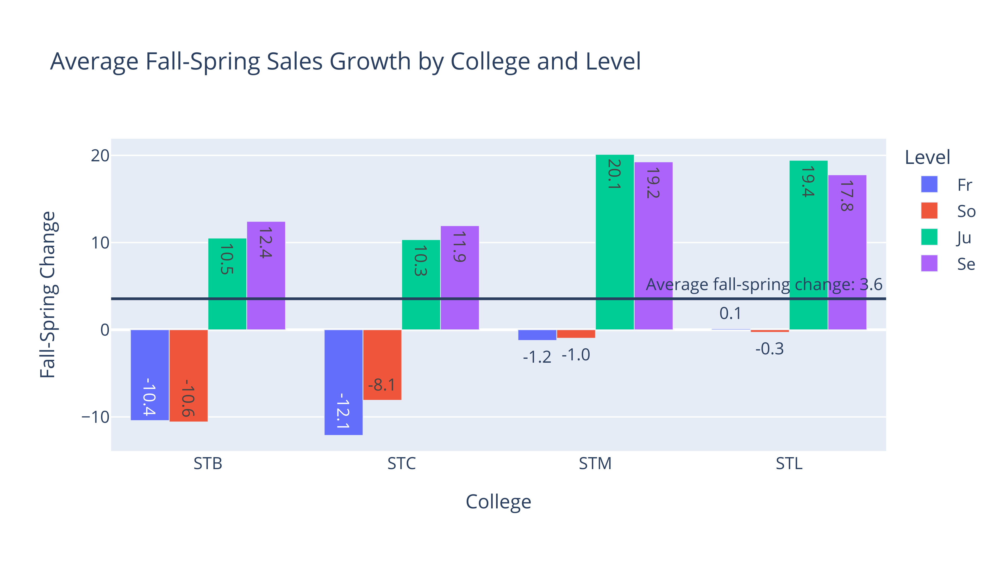

# Python for Nonprofits

By Kenneth Burchfiel

Released under the MIT License

Python for Nonprofits (PFN) is a guide to applying Python in nonprofit settings. Specifically, it teaches you how to use Python to:

* Import data, then clean and reformat it 
* Analyze data using descriptive statistics and linear regressions
* Create both charts and maps
* Share spreadsheets and interactive visualizations online

This project is *not* meant to replace an introductory Python course or textbook. If you're new to Python, I suggest getting started with a resource like Think Python, 3rd Edition (https://greenteapress.com/wp/think-python-3rd-edition/). (I found the 2nd edition of this book to be very helpful in my own studies.) However, as long as you have an introductory background in the language, you should be in a great position to benefit from this project.

Many Python for Nonprofits sections incorporate *simulated* data from a *fictional* university (Northern Virginia Catholic University, or NVCU for short). Educational institutions have a ton of data and many reporting needs, so it made sense to center much of the text on data analysis work for a university. However, PFN also makes use of real-world data from the US Census.

I've released PFN under the MIT license. This means that you can use this code in both commercial and personal applications, *and* that you can choose whatever license you want for your own code. You would just need to give me credit if you use a substantial amount of the code. This choice of license makes PFN much more flexible than many other educational Python resources.

For a more comprehensive guide to to Python for Nonprofits, reference its [Introduction](https://github.com/kburchfiel/pfn/tree/main/Introduction) section.

## Sample Output

Python for Nonprofits will teach you how to create visuals like the following:

(These are all static images, but you'll also learn how to create interactive HTML versions of these charts as well.)

Visualizations are just one component of Python for Nonprofits, but I did want to add some images to this Readme--and maps and charts make for more interesting images than do screenshots of tables!

## How to Use This Resource

Python for Nonprofits is designed to be read from the start to the finish, much like a book. (Indeed, there is a PDF book version of this code available [at this link](https://github.com/kburchfiel/pfn/tree/main/Print_Book/pfn_book.pdf). The book has been released under the MIT License, just like the rest of the project.) If you'd like to use PFN in this manner, you can choose from the following options:

1. You can download and read through the PDF book that I linked to above.

2. You can download the entire project, then open `docs/index.html` within the downloaded folder. This will launch an HTML-based version of the book that includes a built-in table of contents. (Note: I used [Jupyter Book](https://jupyterbook.org/en/stable/intro.html) to create both the PDF- and HTML-based versions of the book.) I do plan to make this HTML-based book available online as well, but I'll first need to work out some bugs with [the online version](https://kburchfiel.github.io/pfn/README.html).

3. You can go through the Jupyter Notebooks, Markdown documents, and Python files that comprise PFN one by one. (The suggested order for doing so is provided below.) If you choose this method, I would still encourage you to first download the project, as you'll then be able to run the files locally.

*Note: When running these notebooks on your own computer, you may want to confirm that the `render_for_pdf` setting within the `Appendix/helper_funcs.py` file is set to False. That way, many visualizations will appear in interactive HTML rather than static PNG format. (If `render_for_pdf` was initially set to True, you'll need to rerun each section after changing it to False in order for that change to take effect.)*

You can of course choose to skip over sections with which you are already familiar or don't (yet) have a need for; however, do keep in mind that later sections assume that you have already read through earlier ones.

Finally, the best way to internalize this content is to use it as the starting point for your own projects. In the future, I may also add suggested 'homework' that will make this practice a bit more formal--but for now, you'll need to 'BYOA' (bring your own assignments). One option would be to find a dataset related to a subject that interests you, then apply the contents of each section to clean, analyze, and visualize it.
### Initial setup

I created much of PFN within [Jupyter Desktop](https://github.com/jupyterlab/jupyterlab-desktop), an open-source tool for opening and viewing Jupyter Notebooks. I recommend that you use this program for viewing PFN notebooks also, though PFN should run well within other Jupyter Notebook viewers as well. 

You'll of course also want to have Python set up on your computer. As noted within The Case for Python at Nonprofits, I recommend that you install and use Python (and the libraries that PFN applies) via Miniforge rather than Anaconda, as you may not be able to use the latter for free. 

Although most of the libraries that Python for Nonprofits uses are available within conda-forge (https://github.com/conda-forge), some may need to be installed via pip (https://pypi.org/). 

## Table of Contents

[Note: this table of contents does not reference source data files, but the code files will help you locate them.]

[README](https://github.com/kburchfiel/pfn/blob/main/README.md) [this page]

#### Part 1: [Introduction](https://github.com/kburchfiel/pfn/tree/main/Introduction)

1. [**Introduction**](https://github.com/kburchfiel/pfn/blob/main/Introduction/introduction.md)

1. [**The Case for Using Python at Nonprofits**](https://github.com/kburchfiel/pfn/blob/main/Introduction/the_case_for_python_at_nonprofits.md)

#### Part 2: [Importing](https://github.com/kburchfiel/pfn/tree/main/Data_Prep) and [Prepping](https://github.com/kburchfiel/pfn/tree/main/Data_Prep) Data

1. [**Data Retrieval**](https://github.com/kburchfiel/pfn/blob/main/Data_Retrieval/data_retrieval.ipynb)

1. [**Data Prep**](https://github.com/kburchfiel/pfn/blob/main/Data_Prep/data_prep.ipynb)

1. [**Census Data Imports**](https://github.com/kburchfiel/pfn/blob/main/Census_Data_Imports/census_data_imports.ipynb)

    1. [Census Data Import Scripts](https://github.com/kburchfiel/pfn/blob/main/Census_Data_Imports/census_import_scripts.py)

#### Part 3: [Analyzing Data](https://github.com/kburchfiel/pfn/tree/main/Descriptive_Stats)

1. [**Descriptive Stats**](https://github.com/kburchfiel/pfn/blob/main/Descriptive_Stats/descriptive_stats.ipynb)

1. [**Descriptive Stats: Part 2**](https://github.com/kburchfiel/pfn/blob/main/Descriptive_Stats/descriptive_stats_part_2.ipynb)

#### Part 4: Visualizing Data via [Graphs](https://github.com/kburchfiel/pfn/blob/main/Descriptive_Stats/descriptive_stats_part_2.ipynb) and [Maps](https://github.com/kburchfiel/pfn/tree/main/Mapping)

1. [**Graphing**](https://github.com/kburchfiel/pfn/blob/main/Graphing/graphing.ipynb)

1. [**Pivot and Graph Functions**](https://github.com/kburchfiel/pfn/blob/main/Graphing/pivot_and_graph_functions.ipynb)

1. [**Choropleth Maps**](https://github.com/kburchfiel/pfn/blob/main/Mapping/choropleth_maps.ipynb)

    1. [Plotly Choropleth Map Functions](https://github.com/kburchfiel/pfn/blob/main/Mapping/plotly_choropleth_map_functions.py)

1. [**Choropleth maps with Folium**](https://github.com/kburchfiel/pfn/blob/main/Mapping/choropleth_maps_with_folium.ipynb)

    1. [Folium Choropleth Map Functions](https://github.com/kburchfiel/pfn/blob/main/Mapping/folium_choropleth_map_functions.py)

#### Part 5: [Regressions](https://github.com/kburchfiel/pfn/tree/main/Regressions)

1. [**Regression Analyses**](https://github.com/kburchfiel/pfn/blob/main/Regressions/regression_analyses.ipynb)

#### Part 6: Publishing Analyses Online (via [Static Sites](https://github.com/kburchfiel/pfn/tree/main/Static_Sites), [Online Spreadsheets](https://github.com/kburchfiel/pfn/tree/main/Updating_Online_Spreadsheets), and [Dash Apps](https://github.com/kburchfiel/pfn/tree/main/Online_Visualizations))

1. [**Creating a Simple Static Webpage**](https://github.com/kburchfiel/pfn/blob/main/Static_Sites/simple_static_site.ipynb)

1. [**Updating Online Spreadsheets**](https://github.com/kburchfiel/pfn/blob/main/Updating_Online_Spreadsheets/updating_online_spreadsheets.ipynb)

    1. [Weather Data Import](https://github.com/kburchfiel/pfn/blob/main/Updating_Online_Spreadsheets/weather_import.py)

[The following two links will take you to Dash App project folders. These folders contain both a readme and additional Python/data files.]

1. [**Simple App Without Login**](https://github.com/kburchfiel/pfn/tree/main/Online_Visualizations/Simple_App_Without_Login) 

1. [**PFN Dash App Demo**](https://github.com/kburchfiel/pfn/tree/main/Online_Visualizations/PFN_Dash_App_Demo)

#### Part 7: [Appendix](https://github.com/kburchfiel/pfn/tree/main/Appendix)

1. [**Helper Functions**](https://github.com/kburchfiel/pfn/blob/main/Appendix/helper_funcs.py)

1. [**NVCU Database Generator**](https://github.com/kburchfiel/pfn/blob/main/Appendix/nvcu_db_gen.ipynb)

I had a great time putting Python for Nonprofits together, and I hope that you find that this work helps advance your own nonprofit career. Feel free to contact me at kburchfiel3@gmail.com (or post a message at https://github.com/kburchfiel/pfn/issues ) if you have any questions or notice any errors with the text.

Happy coding!

--Ken

