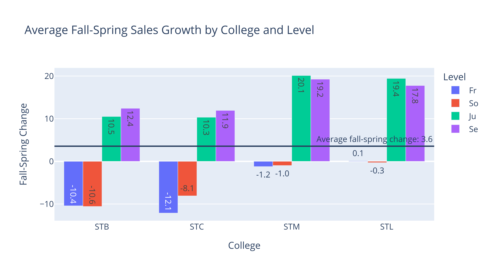
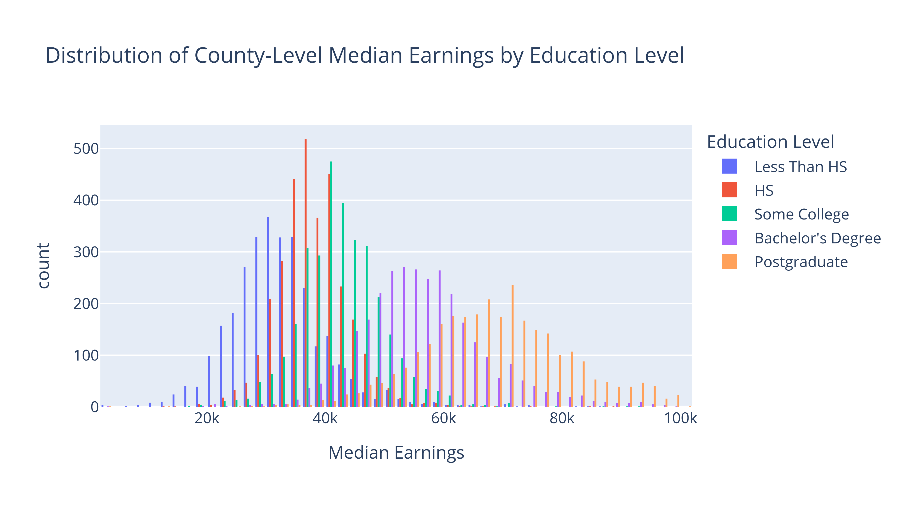
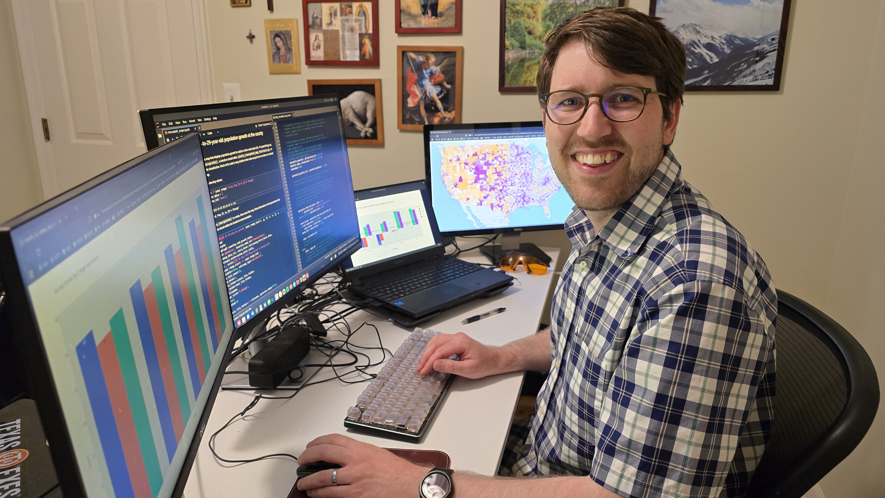

# Wecome to Python for Nonprofits!

Python for Nonprofits (PFN) is a guide to applying Python in nonprofit settings. Specifically, it teaches you how to use Python to:

* Import data, then clean and reformat it 
* Analyze data using descriptive statistics and linear regressions
* Create both charts and maps
* Share spreadsheets and interactive visualizations online

This project is *not* meant to replace an introductory Python course or textbook. If you're new to Python, I suggest getting started with a resource like the 3rd edition of Think Python (https://greenteapress.com/wp/think-python-3rd-edition/). (I found the 2nd edition of this book to be very helpful in my own studies.) However, as long as you have an introductory background in the language, you should be in a great position to benefit from this project.

Many Python for Nonprofits sections incorporate *simulated* data from a *fictional* university (Northern Virginia Catholic University, or NVCU for short). Educational institutions have an immense amount of data and many reporting needs, so it made sense to center much of the text on data analysis work for a university. However, PFN also makes use of real-world data from the US Census Bureau.

I've released PFN under the MIT license. This means that you can use this code in both commercial and personal applications *and* that you can choose whatever license you want for your own project. You would just need to give me credit if you use a substantial amount of the code. This choice of license makes PFN much more flexible than many other educational Python resources.

For a more comprehensive guide to to Python for Nonprofits, reference the Introduction section.

## Sample output

Python for Nonprofits will teach you how to create visuals like the following:

(These are all static images, but you'll also learn how to create interactive HTML versions of these charts as well.)

Visualizations are just one component of Python for Nonprofits, but I did want to add some images to this section--and maps and charts make for more interesting images than do screenshots of tables!

I had a great time putting Python for Nonprofits together, and I hope that you find that this work helps advance your own nonprofit career. Feel free to contact me at kburchfiel3@gmail.com (or post a message at https://github.com/kburchfiel/pfn/issues ) if you have any questions or notice any errors with the text.

Happy coding!

--Ken

(Special thanks to my lovely wife for taking this picture.)